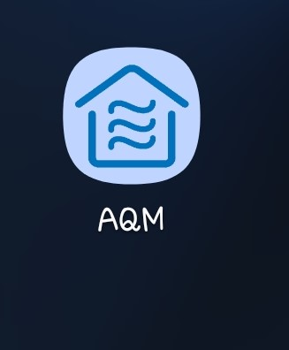
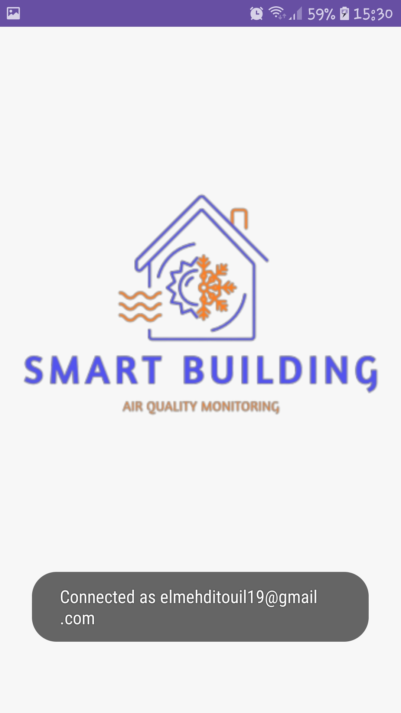

# A-QM

The Air Quality Monitoring app, developed using Java on Android Studio, focuses on collecting real-time data from an Arduino prototype and transmitting it through Firebase Realtime Database. The primary objective of the app is to monitor air quality. Additionally, a room management feature has been implemented for practice purposes, although technically there is only a single room associated with the prototype.

Upon launching the app, users are prompted to authenticate or sign up to create a new account. Once logged in, they are presented with a dashboard displaying four options:

- Room List: Users can view the list of added rooms and have the ability to add or modify them by performing a long press.
- Air Quality Indicators: This section provides a visual representation of general air quality indicators, including temperature (in Celsius), humidity (in percentage), CO2 levels (in ppm), and light intensity (in lux). An Air Quality Index (AQI) is calculated based on a threshold of 1000, with the maximum value obtained being 1200. The app assigns a corresponding comment on the air quality, such as good, bad, or moderate.
- Fan Control: Users can control the real fan by toggling it on or off directly from the app.
- Occupancy Prediction: The app consumes a custom API developed to predict room occupancy based on the previously mentioned air quality indicators.

Although there are plans to add more functionalities, due to time constraints, the existing features provide a comprehensive air quality monitoring solution. Thank you for taking the time to read this description.

**Figure 1: App Icon**

---

### Home Screen: 
The initial screen that greets users when they launch the application is a crucial point of entry into the app's world. It sets the tone and prepares users for the experience that awaits them. Typically, this first screen serves as an introduction or a splash screen, captivating users with a visually pleasing and branded display.
As the application springs to life, the initial screen takes center stage, capturing attention and creating a sense of anticipation. 

It may feature captivating imagery, a captivating logo, or a brief tagline that reflects the app's purpose and personality. This screen is designed to leave a positive first impression on users, igniting their curiosity and motivating them to explore further.

**Figure 2: Home Screen**

---

### Login Screen: 
The LOGIN screen is a crucial element of the application, ensuring that only authorized users can access its features. It provides a secure entry point where users can input their login credentials, such as username and password, to authenticate their identity. By requiring this step, the app establishes a protective barrier, safeguarding sensitive information and maintaining user privacy. 

The LOGIN screen interface typically includes intuitive input fields and clear instructions, guiding users through the authentication process. Additional security measures like two-factor authentication may be incorporated to enhance user data protection. Overall, the login screen acts as a secure gateway, allowing users to access their personalized accounts and ensuring a safe and tailored experience within the application.

**Figure 3: Login Screen**

---

### Sign Up Screen: 
The SIGN UP screen serves as a platform for new users to register an account within the application. It offers a streamlined process for users to provide necessary information such as username, address (optional), email address, and password. By filling out these details, users can create a personalized account and unlock the application's full range of functionalities. 

The SIGN UP screen ensures a smooth and intuitive experience, guiding users through the registration process with clear instructions and input fields. It acts as a crucial step in expanding the user base and allowing individuals to fully engage with the application's features and services. Overall, the sign-up screen facilitates the onboarding process, enabling new users to establish their presence and begin their journey within the application.

Figure 6: Room Lists Screen

Figure 7: Detect Occupancy Screen

Figure 8: Edit Room Screen

Figure 9: Fan Control Screen

Figure 10: Overview Screen

Figure 11: Room Options Screen

Figure 12: Search Screen

Figure 13: Occupancy Result Screen

Figure 14: Sign Out Screen
